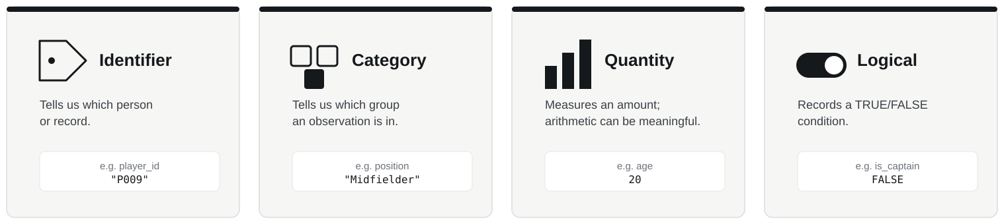

## How this module works

Two concurrent strands run every week:

- **Contemporary applications**: weekly post-class reading on real-world sport analytics issues. Feeds Assessment Two.
- **The data analytics pipeline**: building R fluency through a basic analytical workflow. Feeds Assessment One.

> **import → inspect → manipulate → clean → combine → summarise/visualise → interpret**

A recurring question runs through both:

> **What can R do for us, and what judgement does R still require us to make?**

------------------------------------------------------------------------

## How the module is assessed

**Assessment One: Using R** (40% of module grade)

- Open-book MCQ, Week 8 (12 November)
- 22 questions across five independent sections
- Based on the CORE repertoire from Weeks 1 to 6

**Assessment Two: Critical Review** (60% of module grade)

- 3,000-word written submission, due 18 December
- Draws on the contemporary applications reading

**To pass:** at least 50% overall, and at least 50% in each element.

------------------------------------------------------------------------

## Our six-week analytical journey

{width="100%"}

Today we begin with the foundation:

# UNDERSTAND

------------------------------------------------------------------------

## Before we start

# Introduction to RStudio

------------------------------------------------------------------------

## Switching presentations

A short separate walkthrough now covers:

- how RStudio is organised (console, script, environment, files/plots);
- what an R Project is and why we use one;
- where today's files live.

**We return to this deck for PART ONE afterwards.**

------------------------------------------------------------------------

## PART ONE

# Introduction

------------------------------------------------------------------------

## Today's central question

# What does our data mean, and how is R representing it?

::: why
**WHY:** R can execute an operation correctly even when the operation is analytically meaningless.
:::

> **R knows the representation. The analyst has to understand the meaning.**

------------------------------------------------------------------------

## Starting problem

A squad table contains:

| player_id | squad_number | age | position   |
|-----------|-------------:|----:|------------|
| P001      |            2 |  22 | Midfielder |
| P008      |           30 |  24 | Goalkeeper |

These are the same Strathclyde FC player identities we will return to in later weeks.

R can calculate the mean squad number.

### Is that useful information?

------------------------------------------------------------------------

## Start with the row

Before analysing anything, ask:

> **What does one row represent?**

For the Strathclyde FC squad:

**one row = one player**

That is the table's **grain**.

------------------------------------------------------------------------

## Variables have analytical roles

{width="100%"}

The role comes from meaning, not appearance.

------------------------------------------------------------------------

## Numbers do not all mean the same thing

`squad_number` and `age` may both be stored as numbers.

But:

- `age` measures an amount;
- `squad_number` primarily labels a player.

Arithmetic is meaningful for one and usually meaningless for the other.

------------------------------------------------------------------------

## Ask R how it represents the data

``` r
head(squad)
glimpse(squad)
```

Then inspect particular variables:

``` r
class(squad$age)
class(squad$position)
class(squad$squad_number)
```

These tell us about **representation**.

We still have to decide what the variables **mean**.

------------------------------------------------------------------------

## Match the operation to the meaning

For a measured quantity such as `age`:

``` r
mean(squad$age)
min(squad$age)
max(squad$age)
```

For a category such as `position`:

``` r
table(squad$position)
```

The function follows from the analytical question.

------------------------------------------------------------------------

## The squad-number trap

``` r
mean(squad$squad_number)
```

The code runs.

The arithmetic is correct.

The result still tells us little of analytical value.

> **Technically valid is not the same as analytically meaningful.**

------------------------------------------------------------------------

## PART TWO

# Pick up your task sheet

------------------------------------------------------------------------

## Work through, in order

- **CORE**: Strathclyde FC squad (`week01_session.R`)
- **TRANSFER**: swimming dataset
- **CHALLENGE**: representation audit, if time allows

Use the hint sheet if you get stuck.

**Slides are paused until we regroup.**

------------------------------------------------------------------------

## PART THREE

# Regroup: whole-group debrief

------------------------------------------------------------------------

## What has transferred?

Football:

`squad_number`

Swimming:

`lane`

Both may be numeric.

Neither is primarily a measured quantity.

### The transferable skill is recognising meaning.

------------------------------------------------------------------------

## So what?

Before asking R to calculate anything, an analyst needs to know:

> **what one row represents and what each variable means**

That is the beginning of analytical judgement.

------------------------------------------------------------------------

## Assessment One connection

You may be asked to:

- inspect an unfamiliar table;
- identify what one row represents;
- interpret a variable's role and R type;
- decide whether a proposed operation is meaningful.

It is not enough to know that `mean()` exists.

------------------------------------------------------------------------

## End-of-week checkpoint

You should be able to explain:

> **what one row represents**

> **identifier vs category vs quantity vs logical**

> **R type vs analytical meaning**

> **why technically correct code can still support poor analysis**

Next week:

# TRUST

