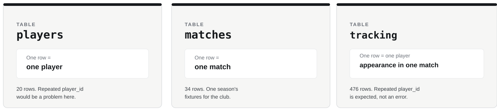

## Our six-week analytical journey

{width="100%"}

Today:

# TRUST

------------------------------------------------------------------------

## PART ONE

# Introduction

------------------------------------------------------------------------

## Central question

# Did the data enter R correctly, and should we trust what came in?

::: why
A successful import is not proof that the resulting data are analytically usable.
:::

> **Every downstream result depends on the integrity of the data foundation.**

------------------------------------------------------------------------

## Consequence problem

A GPS file imports with no error.

But one field has the wrong type, some values are missing, and an identifier does not match the roster.

A coach wants a report today.

### Are we ready to analyse?

------------------------------------------------------------------------

## Our trust workflow

> **IMPORT → INSPECT → CHECK → VERIFY → STATE WHAT REMAINS UNCERTAIN**

We are not trying to prove that the data are perfect but...

We ARE trying to establish what we can reasonably trust before analysis begins.

------------------------------------------------------------------------

## Set up your workspace

1.  **Download** the Week 2 project (`week_two_r_project.zip`)
2.  **Decompress** it (Extract All on Windows; double-click on a Mac)
3.  **Open** `week_two.Rproj` in RStudio
4.  Check that the Files pane shows the `data` folder
5.  **Create a new script**: File \> New File \> R Script
6.  Type the commands as we go, and add your own comments (lines starting with `#`)

------------------------------------------------------------------------

## Import, then inspect

``` r
library(tidyverse)

players <- read_csv("data/players.csv")
matches <- read_csv("data/match_results.csv")
tracking <- read_csv("data/player_match_tracking.csv")
```

Then ask:

``` r
glimpse(players)
head(players)
```

- Does the object look like the table we expected?
- What does one row represent?
- Are important variables represented plausibly?

------------------------------------------------------------------------

## Three Strathclyde FC tables

{width="100%"}

**The grain of a table is what one row represents.**

These three tables have different grain. That affects what repeated IDs mean.

------------------------------------------------------------------------

## Dimensions are a basic expectation check

``` r
nrow(players)
ncol(players)
names(players)
```

These are not sophisticated analyses.

They help answer a fundamental question:

> **Did we import the object we thought we imported?**

------------------------------------------------------------------------

## Check important representations

``` r
class(players$player_id)
class(players$squad_number)
class(players$contract_end)
```

Do not inspect every type for its own sake.

Focus on variables whose representation could affect later analysis.

------------------------------------------------------------------------

## Dates need an explicit interpretation

`contract_end` is stored as text, in `DD/MM/YYYY` layout.

``` r
players$contract_end <- as.Date(
  players$contract_end,   # the text column to convert
  format = "%d/%m/%Y"     # how to read it: day/month/year
)
```

- `%d` is the day, `%m` the month and `%Y` the four-digit year
- The `/` characters match the separators in the file
- We tell R the layout; it does not guess
- The result replaces the original column

If the layout does not match, R gives `NA` rather than an error.

------------------------------------------------------------------------

## Verify the conversion

``` r
class(players$contract_end)           # is it now a Date?
sum(is.na(players$contract_end))      # did any values fail to convert?
head(players$contract_end)            # do the converted values look right?
min(players$contract_end)             # earliest date
max(players$contract_end)             # latest date
```

> **A conversion is not complete until we check what happened to the actual values.**

A wrong conversion can still produce a `Date` column with no missing values.

------------------------------------------------------------------------

## Missingness and plausibility are different questions

``` r
sum(is.na(tracking$match_rating))
```

Missing means there is no recorded value.

A recorded value can still be unusual or implausible.

Use familiar summaries such as `min()` and `max()` to ask whether important numerical fields look plausible.

Today we identify concerns.

Week 4 asks how to intervene.

------------------------------------------------------------------------

## Identifier coverage: what are we asking?

Each row in `tracking` is one player in one match.

It names the player (`player_id`) and the match (`match_id`).

The `players` and `matches` tables are our reference lists: who exists, and which matches were played.

> **Does every ID used in `tracking` appear in its reference table?**

------------------------------------------------------------------------

## Identifier coverage: how R answers

``` r
tracking$player_id %in% players$player_id
```

- For each value on the left, is it found on the right?
- The answer is one `TRUE` or `FALSE` per row of `tracking`

``` r
all(tracking$player_id %in% players$player_id)
```

- `all()` collapses those answers into one
- `TRUE` only if every single value was found

``` r
all(tracking$match_id %in% matches$match_id)
```

Same question, for matches.

------------------------------------------------------------------------

## Identifier coverage: reading the result

`TRUE` tells us that every ID in `tracking` has a match in the reference table.

It does **not** tell us that:

- the IDs point to the right player or match;
- the measurements attached to them are accurate;
- every player or match in the reference table appears in `tracking`.

`FALSE` tells us something is unmatched. We would then look for which values failed before deciding whether the data are wrong.

These checks prepare the ground for joining tables in Week 5.

------------------------------------------------------------------------

## The trust statement

A good trust statement separates:

**what we have verified**

from

**what we have not yet established**

For example, correct structure does not prove every measurement is accurate.

------------------------------------------------------------------------

## PART TWO

# Open the Week Two Task Sheet

------------------------------------------------------------------------

## Work through, in order

- **CORE**: establish trust in the Strathclyde FC data
- **TRANSFER**: diagnose an unfamiliar athletics results file
- **EXTENSION**: trust audit, if time allows

Use the hint sheet if you get stuck.

**Slides are paused until we regroup.**

------------------------------------------------------------------------

## PART THREE

# Regroup: whole-group debrief

------------------------------------------------------------------------

## Unusual does not mean wrong

`DNS` may be meaningful information.

`01` may be an identifier.

A mixed-format date may genuinely obstruct analysis.

The analyst must distinguish:

> **unusual value vs representation problem vs possible data-quality problem**

------------------------------------------------------------------------

## So what?

A sophisticated model built on misunderstood input is still a poor analysis.

> **Trust is established, not assumed.**

------------------------------------------------------------------------

## Assessment One connection

You may need to:

- import and inspect unfamiliar tables;
- identify their grain;
- recognise meaningful representation problems;
- detect missing or implausible evidence;
- test whether identifiers are covered by a reference table.

The important skill is deciding which checks matter.

------------------------------------------------------------------------

## End checkpoint

Before analysing imported data, can you say:

1.  what one row represents?
2.  whether the table and important variables look as expected?
3.  whether important values are missing or implausible?
4.  whether identifiers connect as expected?
5.  what remains uncertain?

Next week:

# TRANSFORM
