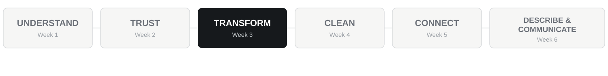
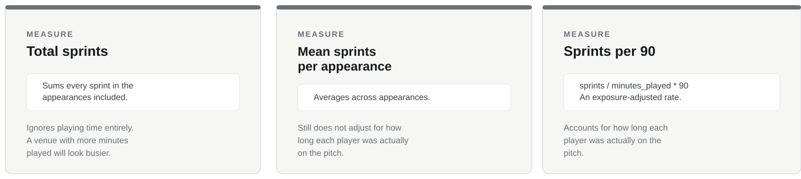

## Our six-week analytical journey

{width="100%"}

Today:

# TRANSFORM

------------------------------------------------------------------------

## PART ONE

# Introduction

------------------------------------------------------------------------

## Retrieval

What does one row in `tracking` represent?

Which variable tells us playing exposure?

Why might a raw count and an exposure-adjusted rate answer different questions?

------------------------------------------------------------------------

## Central question

# What are we trying to find out, and what must happen to the data to answer it?

::: {.why}
**Start with the question, not the function.**
:::

------------------------------------------------------------------------

## Consequence problem

A coach asks:

> **Were our players more explosive at home?**

{width="100%"}

### Which one answers the question?

------------------------------------------------------------------------

## The question needs an operational definition

"More explosive" is not stored in the data.

We must decide how to represent it.

A better question might be:

> **Among appearances of at least 60 minutes, did players complete sprints at a higher rate at home or away?**

Now the required data operations are much clearer.

------------------------------------------------------------------------

## Our core transformation workflow

> **QUESTION → FILTER → DERIVE → GROUP → SUMMARISE → INTERPRET**

Not every question needs every step.

But each step should exist because the question requires it.

------------------------------------------------------------------------

## Pipes express the sequence

```r
tracking |>
  filter(minutes_played >= 60)
```

Read it as:

> take tracking → keep the observations relevant to the question

The pipe is useful because the code can follow the analytical logic.

------------------------------------------------------------------------

## Step 1: filter the relevant observations

```r
filter(minutes_played >= 60)
```

The condition comes from the question.

Change the question and the filter may need to change.

------------------------------------------------------------------------

## Step 2: derive the measure the question needs

```r
mutate(
  sprints_per_90 = sprints / minutes_played * 90
)
```

Raw sprint count and sprint rate answer different questions.

> **A derived variable embodies an analytical decision.**

------------------------------------------------------------------------

## Step 3: group and summarise

```r
analysis |>
  group_by(venue) |>
  summarise(
    mean_sprints = mean(sprints, na.rm = TRUE),
    mean_sprints_per_90 = mean(sprints_per_90, na.rm = TRUE),
    appearances = n()
  )
```

The grain changes:

**player appearances → venues**

------------------------------------------------------------------------

## The key comparison

Compare the home/away conclusion using:

- mean raw sprints;
- mean sprints per 90.

If the conclusion changes after adjustment, explain why.

If it does not change, explain what the adjusted measure still adds.

### Which measure best matches the wording "at a higher rate"?

------------------------------------------------------------------------

## Supporting tools

You will also encounter useful functions such as:

`select()` · `rename()` · `arrange()`

They can make a table easier to work with or read.

But the central analytical sequence this week is:

> **filter → derive → group → summarise**

------------------------------------------------------------------------

## Conditions express the question

Common conditions include:

`==` · `!=` · `>` · `>=` · `<` · `<=`

Combine them when needed:

`&` means both conditions must be true.

`|` means at least one condition must be true.

The symbols are not the point. The logic is.

------------------------------------------------------------------------

## PART TWO

# Pick up your task sheet

------------------------------------------------------------------------

## Work through, in order

- **CORE**: translate one question into a transformation workflow (`week03_session.R`)
- **TRANSFER**: athletics training load by group
- **CHALLENGE**: two operational definitions of "intensity," if time allows

Use the hint sheet if you get stuck.

**Slides are paused until we regroup.**

------------------------------------------------------------------------

## PART THREE

# Regroup: whole-group debrief

------------------------------------------------------------------------

## Transfer means recognising structure

The sport changes.

The variable names change.

The values change.

But the analytical structure may still be:

> **filter → group → summarise → interpret**

That recognition is more important than remembering a copied code block.

------------------------------------------------------------------------

## So what?

A pipe can run perfectly.

A summary can be numerically correct.

The analysis can still answer the wrong question.

> **The analyst is responsible for the definition and the sequence.**

------------------------------------------------------------------------

## Assessment One connection

The assessment may require you to recognise and sequence a short workflow such as:

> **filter → derive → group → summarise → interpret**

The variables and analytical question may differ from those used in class.

Supporting functions may help, but difficulty comes from choosing the right operations for the question.

------------------------------------------------------------------------

## End checkpoint

Can you take a plain-language analytical question and identify:

1. which observations are relevant?
2. whether a new variable is needed?
3. whether grouping is required?
4. what should be summarised?
5. what the result actually answers?

Next week:

# CLEAN

