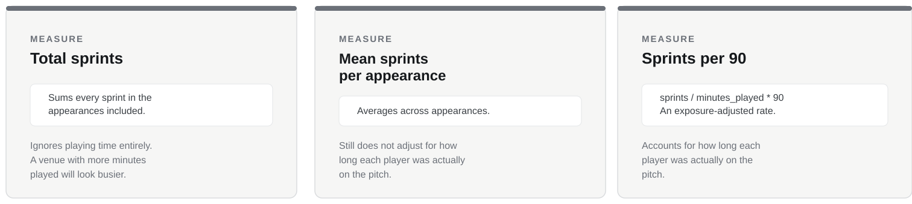

## Our six-week analytical journey

{width="100%"}

Today:

# TRANSFORM

------------------------------------------------------------------------

## PART ONE

# Introduction

------------------------------------------------------------------------

## Before we start

# Revision: Week 2

------------------------------------------------------------------------

## Set up your workspace

1.  **Download** the Week 3 project (`week_three_r_project.zip`)
2.  **Decompress** it (Extract All on Windows; double-click on a Mac)
3.  **Open** `week_three.Rproj` in RStudio
4.  Check that the Files pane shows the `data` folder
5.  **Create a new script**: File \> New File \> R Script, and save it
6.  Type the commands as we go, and add your own comments (lines starting with `#`)

------------------------------------------------------------------------

## Last week: establishing trust

> **Did the data enter R correctly, and should we trust what came in?**

Our workflow was:

> **IMPORT → INSPECT → CHECK → VERIFY → STATE WHAT REMAINS UNCERTAIN**

Each step used a small number of functions.

On the revision slides that follow, try to write the code **before** it appears.

------------------------------------------------------------------------

## Revision 1: import and inspect

Import `players.csv` and `player_match_tracking.csv` from the `data` folder, then take a first look at `players`.

. . .

``` r
library(tidyverse)

players  <- read_csv("data/players.csv")
tracking <- read_csv("data/player_match_tracking.csv")

glimpse(players)     # every column, its type and its first values
head(players)        # the first six rows
```

What does one row represent in `players`? In `tracking`?

That is the **grain** of each table.

------------------------------------------------------------------------

## Revision 2: is this the table we expected?

Find the number of rows and columns in `players`, then ask R how it has stored `squad_number` and `contract_end`.

. . .

``` r
nrow(players)                   # 20
ncol(players)                   # 8
names(players)

class(players$squad_number)     # "numeric"
class(players$contract_end)     # "character"
```

`squad_number` is stored as a number but it labels a player.

`contract_end` is a date but it is stored as text.

> **R knows the representation. The analyst has to understand the meaning.**

------------------------------------------------------------------------

## Revision 3: dates need an explicit format

`contract_end` is text in `DD/MM/YYYY` layout. Convert it to a date, then check that the conversion worked.

. . .

``` r
players$contract_end <- as.Date(
  players$contract_end,
  format = "%d/%m/%Y"
)

class(players$contract_end)          # "Date"
sum(is.na(players$contract_end))     # 0: nothing failed to convert
min(players$contract_end)            # "2025-06-30"
max(players$contract_end)            # "2029-06-30"
```

> **A conversion is not complete until we check what happened to the actual values.**

------------------------------------------------------------------------

## Revision 4: how many values are missing?

Count the missing values in `match_rating` in the `tracking` table.

. . .

``` r
is.na(tracking$match_rating)         # one TRUE or FALSE per row
sum(is.na(tracking$match_rating))    # 34
```

-   `NA` is how R marks a value that was never recorded
-   `is.na()` asks of every row: is this value missing? It answers `TRUE` or `FALSE`
-   `sum()` counts how many of those answers are `TRUE`

So 34 of the 476 appearances have no rating. The other 442 do.

------------------------------------------------------------------------

## Revision 4: what missing values do to a summary

Find the smallest and largest `match_rating`.

. . .

``` r
min(tracking$match_rating)                   # NA
min(tracking$match_rating, na.rm = TRUE)     # 1
max(tracking$match_rating, na.rm = TRUE)     # 5
```

-   **Why `NA`?** R cannot know whether one of the 34 missing ratings would have been the smallest, so it refuses to guess
-   **`na.rm = TRUE`** means "remove the missing values first": the answer comes from the 442 recorded ratings only
-   `max()` and `mean()` behave in the same way

You will need `na.rm = TRUE` again today.

------------------------------------------------------------------------

## Revision 4: missing is not the same as implausible

These are two different questions about a variable:

| Question | Check | `match_rating` |
|----------------------|------------------------|--------------------------|
| **Missing:** was a value recorded at all? | `sum(is.na())` | 34 values were not recorded |
| **Implausible:** is a recorded value hard to believe? | `min()` and `max()` | 1 to 5: believable for a rating |

A variable can have missing values and still be plausible, as here.

A variable can also be complete and still contain values that deserve investigation.

> **Run both checks. Neither one answers the other.**

------------------------------------------------------------------------

## Revision 5: do the identifiers connect?

Each row in `tracking` is one player in one match. It names the player with `player_id`.

The `players` table is our reference list: who exists in the squad.

> **Does every `player_id` used in `tracking` appear in `players`?**

Why it matters:

-   if an ID has no match, any analysis by player is built on rows we cannot explain;
-   today you will group by `player_id`;
-   in Week 5 you will join these two tables.

------------------------------------------------------------------------

## Revision 5: `%in%` on a small example

`c()` combines values. Here it holds two IDs: one real, one invented.

Predict the result, then run it:

``` r
c("P001", "P021") %in% players$player_id
```

. . .

``` r
TRUE FALSE
```

-   For each value on the **left**: is it found on the **right**?
-   `P001` is in the squad list. `P021` is not: there are only 20 players.
-   There is one answer for every value on the left.

------------------------------------------------------------------------

## Revision 5: every row of `tracking`

Now ask the same question of every `player_id` in `tracking`, and collapse the answers into one.

. . .

``` r
tracking$player_id %in% players$player_id         # 476 answers, one per row

all(tracking$player_id %in% players$player_id)    # TRUE
sum(tracking$player_id %in% players$player_id)    # 476
```

-   `all()` is `TRUE` only if every single answer is `TRUE`
-   `sum()` counts how many answers are `TRUE`: all 476 rows have a matching player

This is the same idea as `sum(is.na())`: a column of `TRUE` and `FALSE`, counted.

------------------------------------------------------------------------

## Revision 5: does the direction matter?

Now reverse the check: does every player in `players` appear in `tracking`?

. . .

``` r
all(players$player_id %in% tracking$player_id)    # TRUE
```

The two directions ask different questions:

| Check | A `FALSE` would mean |
|-------------------------|-----------------------------------------------|
| `tracking` IDs in `players` | a tracking row for a player we have no record of |
| `players` IDs in `tracking` | a squad player who never appears in the tracking data |

The first would be a problem for any join. The second might be legitimate.

------------------------------------------------------------------------

## Revision 5: reading the result

`TRUE` tells us that every ID in `tracking` has a match in the reference table.

It does **not** tell us that:

-   the IDs point to the right player;
-   the measurements attached to them are accurate.

`FALSE` tells us something is unmatched. We would find which values failed before deciding whether the data are wrong.

> **One `TRUE` or `FALSE` per row is also how `filter()` decides which rows to keep. We use that next.**

------------------------------------------------------------------------

## What Week 2 gives us today

Last week these functions told us whether to trust an import:

`glimpse()` · `head()` · `nrow()` · `class()` · `sum(is.na())` · `min()` · `max()` · `%in%`

Today the same functions tell us whether a **transformation** did what we intended.

> **Last week's checks are how we verify this week's transformations.**

------------------------------------------------------------------------

## New this week

# Asking questions and transforming data

------------------------------------------------------------------------

## Central question

# What are we trying to find out, and what must happen to the data to answer it?

::: why
**Start with the question, not the function.**
:::

------------------------------------------------------------------------

## Consequence problem

A coach asks:

> **Were our players more explosive at home?**

{width="100%"}

### Which one answers the question?

------------------------------------------------------------------------

## The question needs an operational definition

"More explosive" is not stored in the data.

We must decide how to represent it.

A better question might be:

> **Among appearances of at least 60 minutes, did players complete sprints at a higher rate at home or away?**

Now the required data operations are much clearer.

------------------------------------------------------------------------

## Our core transformation workflow

> **QUESTION → FILTER → DERIVE → GROUP → SUMMARISE → INTERPRET**

Not every question needs every step.

But each step should exist because the question requires it.

------------------------------------------------------------------------

## A new way to write code: the pipe

So far we have written one function at a time:

``` r
nrow(tracking)
```

The pipe `|>` passes what is on its left into the function on its right:

``` r
tracking |>
  nrow()
```

Both lines give the same answer.

Read `|>` as **"and then"**: take `tracking`, and then count its rows.

The pipe is useful because the code can follow the analytical logic, one step per line.

------------------------------------------------------------------------

## Step 1: filter the relevant observations

``` r
eligible <- tracking |>              # store the result as a new object
  filter(minutes_played >= 60)       # keep rows where this is TRUE
```

-   `filter()` keeps rows; it never changes columns
-   The condition comes from the question: "at least 60 minutes"
-   `tracking` itself is unchanged

Change the question and the filter may need to change.

------------------------------------------------------------------------

## Verify the filter

``` r
nrow(tracking)                    # rows before
nrow(eligible)                    # rows after
min(eligible$minutes_played)      # shortest appearance kept
```

> **A filter is not complete until we check which rows it kept.**

Code that runs without an error may still have kept the wrong rows.

------------------------------------------------------------------------

## Step 2: derive the measure the question needs

``` r
eligible <- eligible |>
  mutate(
    sprints_per_90 = sprints / minutes_played * 90   # new column = calculation
  )
```

-   `mutate()` adds a column; it never removes rows
-   Sprints per minute, multiplied by 90, gives sprints per full match
-   The name on the left of `=` is ours to choose

``` r
head(eligible$sprints_per_90)     # do the values look right?
```

> **A derived variable embodies an analytical decision.**

------------------------------------------------------------------------

## Step 3: what are we asking?

Each row of `eligible` is still one player appearance.

The question compares two venues.

So we need **one row per venue**, holding a typical value for each.

> **Split the rows into groups, then reduce each group to a summary.**

------------------------------------------------------------------------

## Step 3: how R answers

``` r
eligible |>
  group_by(venue) |>                             # split rows by venue
  summarise(
    mean_sprints = mean(sprints),                # typical raw count
    mean_sprints_per_90 = mean(sprints_per_90),  # typical rate
    appearances = n()                            # rows in each group
  )
```

-   `group_by()` changes nothing visible; it marks the groups
-   `summarise()` returns one row per group
-   `n()` counts the rows in each group

------------------------------------------------------------------------

## Step 3: reading the result

The grain has changed:

**player appearances → venues**

Compare the home/away conclusion using:

-   mean raw sprints;
-   mean sprints per 90.

Do the two measures agree?

### Which measure best matches the wording "at a higher rate"?

------------------------------------------------------------------------

## One pipeline

``` r
tracking |>
  filter(minutes_played >= 60) |>
  mutate(sprints_per_90 = sprints / minutes_played * 90) |>
  group_by(venue) |>
  summarise(
    mean_sprints = mean(sprints),
    mean_sprints_per_90 = mean(sprints_per_90),
    appearances = n()
  )
```

The same four steps, with nothing stored in between.

Read it aloud: take `tracking`, **and then** filter, **and then** derive, **and then** group, **and then** summarise.

------------------------------------------------------------------------

## Conditions express the question

Common conditions include:

`==` · `!=` · `>` · `>=` · `<` · `<=`

Combine them when needed:

``` r
tracking |>
  filter(venue == "Home" & minutes_played >= 60)
```

`&` means both conditions must be true.

`|` means at least one condition must be true.

Text values need quotation marks and must match the data exactly.

------------------------------------------------------------------------

## Supporting tools

``` r
tracking |>
  select(player_id, venue, sprints) |>   # keep only these columns
  arrange(desc(sprints))                 # order from largest to smallest
```

`select()` and `arrange()` make a table easier to read.

They do not change what the analysis means.

The central analytical sequence this week is:

> **filter → derive → group → summarise**

------------------------------------------------------------------------

## PART TWO

# Open the Week Three Task Sheet

------------------------------------------------------------------------

## Work through, in order

-   **CORE**: answer new questions about the Strathclyde FC data with the same verbs
-   **TRANSFER**: athletics training load by group
-   **EXTENSION**: two ways to calculate a rate, and two definitions of "intensity", if time allows

Use the hint sheet if you get stuck.

**Slides are paused until we regroup.**

------------------------------------------------------------------------

## PART THREE

# Regroup: whole-group debrief

------------------------------------------------------------------------

## What did your checks reveal?

Goalkeepers had the highest sprint rate of any position.

Changing the threshold from 60 to 75 minutes reversed the venue conclusion.

Neither result came with an error message.

The analyst must still distinguish:

> **unusual value vs representation problem vs possible data-quality problem**

Today we identify concerns.

Week 4 asks how to intervene.

------------------------------------------------------------------------

## Transfer means recognising structure

The sport changes.

The variable names change.

The values change.

But the analytical structure may still be:

> **filter → group → summarise → interpret**

That recognition is more important than remembering a copied code block.

------------------------------------------------------------------------

## So what?

A pipe can run perfectly.

A summary can be numerically correct.

The analysis can still answer the wrong question.

> **The analyst is responsible for the definition and the sequence.**

------------------------------------------------------------------------

## Assessment One connection

The assessment may require you to recognise and sequence a short workflow such as:

> **filter → derive → group → summarise → interpret**

The variables and analytical question may differ from those used in class.

Supporting functions may help, but difficulty comes from choosing the right operations for the question.

------------------------------------------------------------------------

## End checkpoint

Can you take a plain-language analytical question and identify:

1.  which observations are relevant?
2.  whether a new variable is needed?
3.  whether grouping is required?
4.  what should be summarised?
5.  what the result actually answers?

Next week:

# CLEAN
