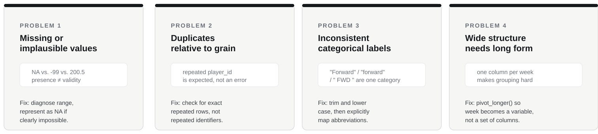

## Our six-week analytical journey

{width="100%"}

Today:

# CLEAN

------------------------------------------------------------------------

## PART ONE

# Introduction

------------------------------------------------------------------------

## Retrieval

Week 2 asked us to identify concerns before analysis.

Week 3 gave us `filter()` and `mutate()`. Today we reuse both for a new purpose: making and applying a defensible cleaning decision.

What is the difference between:

- a missing value;
- a recorded but implausible value;
- a repeated identifier;
- an exact repeated observation?

------------------------------------------------------------------------

## Central question

# What is genuinely wrong, and what change is defensible?

::: {.why}
**Cleaning changes evidence.**
:::

> Every deletion, replacement and recoding decision can affect the result.

------------------------------------------------------------------------

## Consequence problem

An analyst replaces every missing GPS value with the squad mean.

There are now no missing values.

### Is the dataset necessarily better?

------------------------------------------------------------------------

## Our cleaning workflow

> **DIAGNOSE → DECIDE → CLEAN → VERIFY**

Do not begin with a cleaning pipeline.

Begin by identifying what the problem actually is.

------------------------------------------------------------------------

## Four recurring problem structures

{width="100%"}

The functions matter because they help us address these problems.

------------------------------------------------------------------------

## Missing and implausible are not the same

```r
sum(is.na(dirty$distance_km))
```

Missing means no value is recorded.

A value such as `-99` is recorded, but may be a sentinel code rather than a plausible distance.

A value such as `200.5` km is present, but is implausible for one football appearance.

> **Presence is not proof of validity.**

------------------------------------------------------------------------

## Diagnose the range before changing it

Use familiar checks:

```r
min(dirty$distance_km, na.rm = TRUE)
max(dirty$distance_km, na.rm = TRUE)
```

Then ask:

- could this value be real?
- is it a known sentinel?
- can it be corrected from the source?
- should it be represented as missing while investigated?

------------------------------------------------------------------------

## One defensible intervention

For a clearly impossible distance:

```r
dirty <- dirty |>
  mutate(
    distance_km = if_else(
      distance_km < 0 | distance_km > 20,
      NA_real_,
      distance_km
    )
  )
```

The threshold needs a contextual justification.

We are not inventing a replacement value.

------------------------------------------------------------------------

## Duplicates depend on grain

In tracking data:

**one row = one player appearance in one match**

So a repeated `player_id` is expected.

An exact repeated player-match observation may not be.

```r
duplicated(dirty)
distinct(dirty)
```

------------------------------------------------------------------------

## Inconsistent labels can split one category into several

Examples in the dirty extract include:

`Forward` · `forward` · ` FWD `

Trimming and case standardisation help:

```r
str_trim()
str_to_lower()
```

But they do not turn `fwd` into `forward`.

------------------------------------------------------------------------

## Abbreviations need an explicit mapping

After trimming and lowering case:

```r
case_when(
  position == "fwd" ~ "forward",
  position == "def" ~ "defender",
  position == "mf"  ~ "midfielder",
  TRUE ~ position
)
```

This is a recoding decision.

You should be able to explain why the labels are equivalent.

------------------------------------------------------------------------

## Missing-data actions are not neutral

Functions such as `na.omit()` or `replace_na()` can be useful in particular analyses.

But they do very different things:

- dropping rows removes evidence;
- replacing a missing value inserts evidence that was not observed.

Today the core skill is deciding whether an intervention is justified, not rehearsing every possible missing-data treatment.

------------------------------------------------------------------------

## Verify after cleaning

Re-run the checks that revealed the problem:

- missing-value counts;
- ranges;
- duplicate counts;
- distinct category values;
- row count.

> **If you cannot show what changed, you have not finished cleaning.**

------------------------------------------------------------------------

## A different problem: table structure

Wide:

| player | week_1 | week_2 | week_3 |
|---|---:|---:|---:|

Long:

| player | week | training_load |
|---|---|---:|

The same observations can be represented in a structure that is easier to group, summarise and plot.

------------------------------------------------------------------------

## `pivot_longer()` changes the grain

```r
training_long <- training_wide |>
  pivot_longer(
    cols = starts_with("week_"),
    names_to = "week",
    values_to = "training_load"
  )
```

After reshaping, ask again:

> **What does one row represent?**

------------------------------------------------------------------------

## PART TWO

# Pick up your task sheet

------------------------------------------------------------------------

## Work through, in order

- **CORE**: diagnose, decide, clean and verify the dirty extract, then reshape a wide file (`week04_session.R`)
- **TRANSFER**: rugby wellness decision table
- **CHALLENGE**: cleaning decision log for ambiguous values, if time allows

Use the hint sheet if you get stuck.

**Slides are paused until we regroup.**

------------------------------------------------------------------------

## PART THREE

# Regroup: whole-group debrief

------------------------------------------------------------------------

## So what?

Cleaning decisions can change:

- who remains in the data;
- group summaries;
- distributions;
- later joins;
- any conclusion built on the cleaned file.

> **Cleaning is part of the analysis.**

------------------------------------------------------------------------

## Assessment One connection

Core problems include:

- missingness and plausibility;
- duplicates relative to grain;
- string standardisation and simple recoding;
- `pivot_longer()` and the resulting grain;
- verification after cleaning.

`pivot_wider()` remains extension.

------------------------------------------------------------------------

## End checkpoint

Can you explain a cleaning decision without saying:

> "because the code needed it"?

Next week:

# CONNECT

