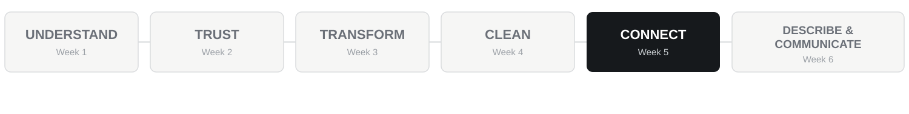
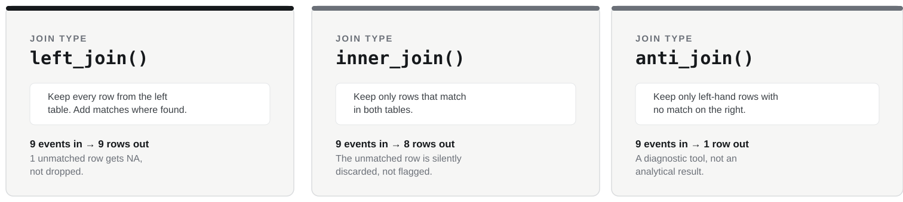

## Our six-week analytical journey

{width="100%"}

Today:

# CONNECT

------------------------------------------------------------------------

## PART ONE

# Introduction

------------------------------------------------------------------------

## Retrieval

Answer without running code:

1. What does one row in `players` represent?
2. What does one row in `tracking` represent?
3. Is `player_id` unique in both tables?
4. What should happen to the number of tracking rows if we correctly add player information while preserving every tracking observation?

------------------------------------------------------------------------

## Central question

# What if the evidence we need is spread across different tables?

::: {.why}
Incorrect joins can lose observations, duplicate observations or silently change the grain.
:::

> **Relationships between datasets are part of the analysis.**

------------------------------------------------------------------------

## Consequence problem

A join runs without an R error.

The resulting table contains fewer rows than the table you started with.

### Is that necessarily a problem? What would you need to know before deciding?

------------------------------------------------------------------------

## Our join workflow

> **QUESTION → TABLES → GRAIN → KEY → EXPECTATION → JOIN → VERIFY → ANALYSE**

The expectation comes before the join.

Verification comes after it.

------------------------------------------------------------------------

## Before joining: know the grain

`players`

> one row = one player

`tracking`

> one row = one player appearance in one match

A player can legitimately occur many times in tracking.

The relationship is not one-to-one.

------------------------------------------------------------------------

## Keys connect matching entities

For Strathclyde FC:

`player_id`

connects player identity to appearance records.

`match_id`

connects match context to appearance records.

A key is useful only if the values actually match.

------------------------------------------------------------------------

## The principal operation: left join

```r
joined <- events |>
  left_join(player_info, by = "player_id")
```

A left join says:

> **preserve the observations in the left-hand table and add matching information where available**

That preservation decision is analytical, not merely technical.

------------------------------------------------------------------------

## A join can run and still fail analytically

`P012`

versus

`p012`

R does not need to produce an error.

The records simply fail to match.

### How do we find them?

------------------------------------------------------------------------

## The diagnostic partner: `anti_join()`

```r
events |>
  anti_join(player_info, by = "player_id")
```

It asks:

> **Which observations on the left found no matching key on the right?**

That is often the fastest way to diagnose a join problem.

------------------------------------------------------------------------

## `inner_join()` provides a useful contrast

```r
events |>
  inner_join(player_info, by = "player_id")
```

An inner join keeps matched observations only.

That may be exactly what a question requires.

It may also silently discard valid observations that should have been preserved.

------------------------------------------------------------------------

## Three ways to combine two tables

{width="100%"}

Same two tables. Same key. Three different answers to "what survives?"

------------------------------------------------------------------------

## A larger row count is not automatically wrong

But if one starting observation becomes several rows unexpectedly:

> **the unit of analysis may have changed**

That can distort every later summary.

The risk grows when a key is not unique in the table you are joining to.

------------------------------------------------------------------------

## Small demonstration first

The demonstration files contain one identifier mismatch.

Before running a join:

1. identify the key;
2. predict the unmatched record;
3. predict the starting row count;
4. decide which observations should survive.

Then run and verify.

------------------------------------------------------------------------

## Full Strathclyde FC analytical table

A question about workload, player position and match result needs information from:

- `tracking`;
- `players`;
- `matches`.

No single source contains the complete evidence.

------------------------------------------------------------------------

## Verify after every join

Check:

```r
nrow(tracking)
nrow(analysis_data)
```

and missing joined fields:

```r
sum(is.na(analysis_data$player_name))
sum(is.na(analysis_data$result))
```

Then ask:

> **Does one row still represent what I think it represents?**

------------------------------------------------------------------------

## PART TWO

# Pick up your task sheet

------------------------------------------------------------------------

## Work through, in order

- **CORE**: connect Strathclyde FC data safely, from small demonstration to the full running case
- **TRANSFER**: athlete testing and squad register
- **CHALLENGE**: role history joined by identity alone, if time allows

Use the hint sheet if you get stuck.

**Slides are paused until we regroup.**

------------------------------------------------------------------------

## PART THREE

# Regroup: whole-group debrief

------------------------------------------------------------------------

## So what?

A joined dataset is not just a table with extra columns.

It is a claim about:

- identity;
- relationships;
- preservation;
- the unit of analysis.

> **The join is part of the analytical argument.**

------------------------------------------------------------------------

## Assessment One connection

The core pattern is:

- know the grain and key;
- decide what must be preserved;
- use `left_join()` deliberately;
- use `anti_join()` to diagnose unmatched records;
- understand what `inner_join()` would discard;
- verify row count and missing joined fields.

------------------------------------------------------------------------

## End checkpoint

Before accepting a join, can you answer:

1. What should one row represent?
2. What key should match?
3. Which observations must survive?
4. What row count do I expect?
5. How will I identify unmatched records?
6. How will I verify the result?

Next week:

# DESCRIBE & COMMUNICATE

